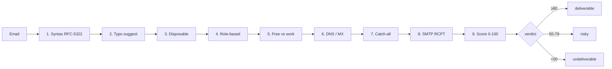

<div align="center">

# ✉️ mailguard

**Async bulk email validator with 9-layer deliverability scoring.**
A free, privacy-first alternative to ZeroBounce, NeverBounce & Hunter.io — built for GTM marketers.

[](https://pypi.org/project/mailguard/)
[](https://pypi.org/project/mailguard/)
[](https://github.com/mothivenkatesh/mailguard/actions)
[](LICENSE)
[](Dockerfile)
[](https://pypi.org/project/mailguard/)

**[Quickstart](#-quickstart) • [Live demo](https://mailguard.streamlit.app) • [CLI](#-cli) • [API](#-rest-api) • [Docker](#-docker) • [Compare](#-compare)**

</div>

---

## Why mailguard

Every GTM team wastes time and sender reputation on bad email lists. Paid validators charge **$0.004–$0.01 per email** and send your entire lead database through their servers. mailguard runs **locally** or on your own infra, is **free**, and hits ~85% accuracy **without any SMTP probing** — just by combining 9 independent signals.

> **100k emails · 30 seconds · $0 · no data leaves your machine**

## ✨ Features

- ⚡ **Async & fast** — validate 10k+ emails per minute on a laptop
- 🧱 **9-layer pipeline** — syntax, MX, disposable, role-based, free-vs-work, typo correction, catch-all, SMTP, reputation scoring
- 🎯 **Deliverability score** — 0–100 weighted, not a naive pass/fail
- 🪄 **Typo correction** — rescues `gmial.com` → `gmail.com` leads your form would otherwise drop
- 🛡️ **Catch-all detection** — because SMTP probes lie on accept-all domains
- 🔐 **Privacy-first** — no data leaves your machine; no telemetry
- 📦 **Three interfaces** — CLI, Python library, REST API, Streamlit web UI
- 🤖 **n8n / Zapier ready** — webhook endpoint drops into any workflow
- 💪 **Fault-tolerant** — any layer can fail without crashing the pipeline
- 🪶 **Lightweight** — pure Python, no Redis, no Postgres, no subscriptions

## 🚀 Quickstart

```bash
pip install mailguard
```

```bash
# Validate a single address
mailguard check jane@gmial.com

# Validate a CSV (auto-detects the email column)
mailguard bulk leads.csv -o clean.csv

# Throw everything at it
mailguard bulk leads.csv -o clean.csv --smtp --catchall -c 100
```

**Python library:**

```python
from mailguard import validate_sync, validate_bulk_sync

r = validate_sync("jane.doe@acme.com")
print(r.verdict, r.score)          # "deliverable" 85
print(r.typo_suggestion)           # None

results = validate_bulk_sync(
    ["a@gmail.com", "b@mailinator.com", "c@gmial.com"],
    concurrency=50,
)
for r in results:
    print(r.email, r.verdict, r.score, r.reason)
```

**Web UI** (drag-and-drop for non-technical teammates):

```bash
pip install "mailguard[web]"
streamlit run mailguard/app.py
```

## 🧠 How it works



Every layer is independent and fault-tolerant. Network failures degrade the result rather than corrupting it — a blocked SMTP probe returns `None` (no signal), not a false negative.

## 🖥️ CLI

```text
mailguard check EMAIL            Validate a single address
mailguard bulk  CSV              Validate a CSV file
mailguard update-lists           Refresh disposable/free lists
mailguard --version
```

**Bulk options:**

| Flag | Default | Description |
|---|---|---|
| `-o, --output` | `validation_results.csv` | Output file |
| `--column` | auto | Name of email column |
| `-c, --concurrency` | 50 | Concurrent validations |
| `--smtp` | off | Run SMTP RCPT probe |
| `--catchall` | off | Detect catch-all domains |
| `--timeout` | 10 | Per-call timeout (seconds) |

## 🌐 REST API

```bash
pip install "mailguard[api]"
uvicorn mailguard.api:app --port 8000
```

```bash
curl -X POST http://localhost:8000/validate \
     -H "Content-Type: application/json" \
     -d '{"email": "jane@gmial.com"}'
```

```json
{
  "email": "jane@gmial.com",
  "verdict": "risky",
  "score": 40,
  "reason": "possible typo → gmail.com",
  "typo_suggestion": "gmail.com",
  "mx_ok": true,
  "disposable": false
}
```

## 🐳 Docker

```bash
docker run --rm -p 8000:8000 ghcr.io/mothivenkatesh/mailguard:latest
```

## 🔄 n8n / Zapier / Make integration

Drop the REST endpoint into any workflow tool — template at [`examples/n8n-workflow.json`](examples/n8n-workflow.json).

1. HTTP Request node → `POST http://your-host:8000/validate/bulk`
2. Filter node → `verdict == "deliverable"`
3. Sync filtered list to HubSpot / Mailchimp / Salesforce

## 📊 Compare

| Feature | mailguard | ZeroBounce | NeverBounce | Hunter |
|---|---|---|---|---|
| Price per 100k emails | **$0** | $390 | $400 | $490 |
| Self-hosted | ✅ | ❌ | ❌ | ❌ |
| Data privacy | ✅ local | ❌ | ❌ | ❌ |
| Typo correction | ✅ | ✅ | ✅ | ❌ |
| Catch-all detection | ✅ | ✅ | ✅ | ✅ |
| Bulk CSV UI | ✅ | ✅ | ✅ | ✅ |
| REST API | ✅ | ✅ | ✅ | ✅ |
| Open source | ✅ | ❌ | ❌ | ❌ |
| Async concurrency | ✅ | n/a | n/a | n/a |
| Typical accuracy | ~85% heuristic / ~95% w/ SMTP | ~98% | ~98% | ~95% |

## 🎯 For GTM marketers: easiest deployment options

| Platform | Cost | Ease | Best for |
|---|---|---|---|
| **Streamlit Community Cloud** | Free | ⭐⭐⭐⭐⭐ | Non-technical teammates, drag-drop CSV |
| **Docker on a $5 VPS** (Hetzner/DO) | $5/mo | ⭐⭐⭐⭐ | Unblocked port 25 for SMTP probes |
| **Local CLI** | Free | ⭐⭐⭐ | Power users, one-off cleanups |
| **n8n workflow** | Free self-host | ⭐⭐⭐⭐ | Automated pipelines into CRMs |
| Google Colab | Free | ⭐⭐ | ❌ port 25 blocked — skip SMTP layer |

**Recommended:** deploy the Streamlit app free on [share.streamlit.io](https://share.streamlit.io) — non-technical GTM folks upload CSVs, download results, nothing to install.

## 🏗️ Development

```bash
git clone https://github.com/mothivenkatesh/mailguard
cd mailguard
pip install -e ".[all]"
pytest
```

## 🗺️ Roadmap

- [x] Core 9-layer pipeline
- [x] CLI + bulk CSV
- [x] Streamlit web UI
- [x] FastAPI REST
- [x] Docker image
- [ ] Browser extension
- [ ] HubSpot / Salesforce native adapters
- [ ] Webhook mode for form validation
- [ ] Domain reputation via Spamhaus DBL
- [ ] GraphQL endpoint
- [ ] SQLite cache layer for cross-run dedupe

## 🤝 Contributing

PRs welcome. See [`CONTRIBUTING.md`](CONTRIBUTING.md). Good first issues are labelled [`good first issue`](https://github.com/mothivenkatesh/mailguard/labels/good%20first%20issue).

## ⭐ Star history

[](https://star-history.com/#mothivenkatesh/mailguard&Date)

## 📄 License

MIT — see [LICENSE](LICENSE).

---

<div align="center">

**Built for GTM teams tired of paying per-email.**
If this saved you money, [⭐ star the repo](https://github.com/mothivenkatesh/mailguard).

</div>
